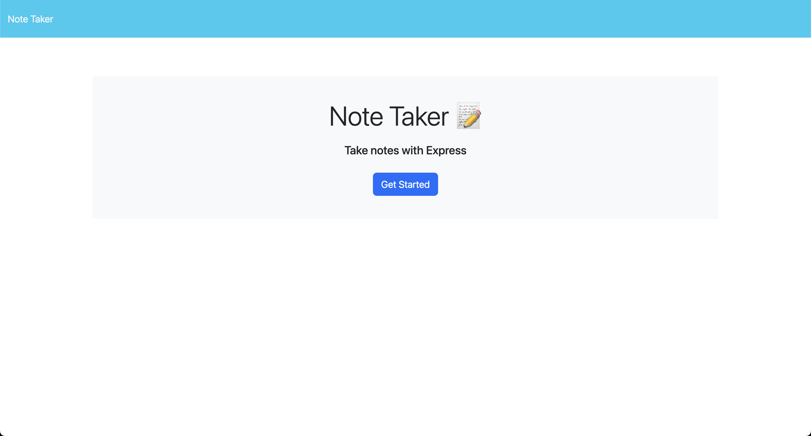
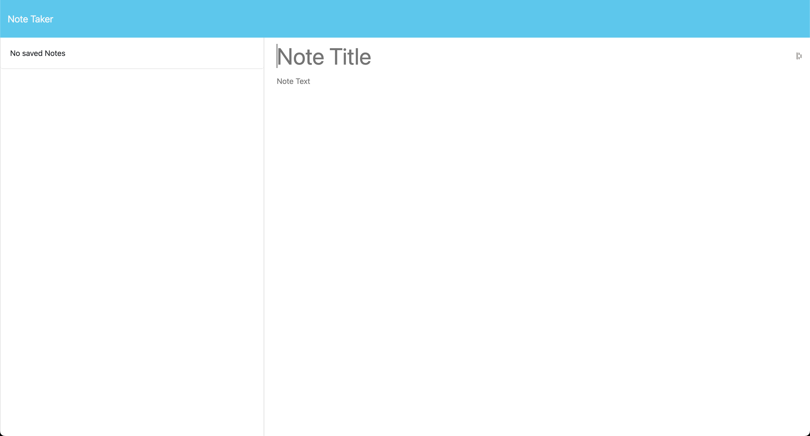
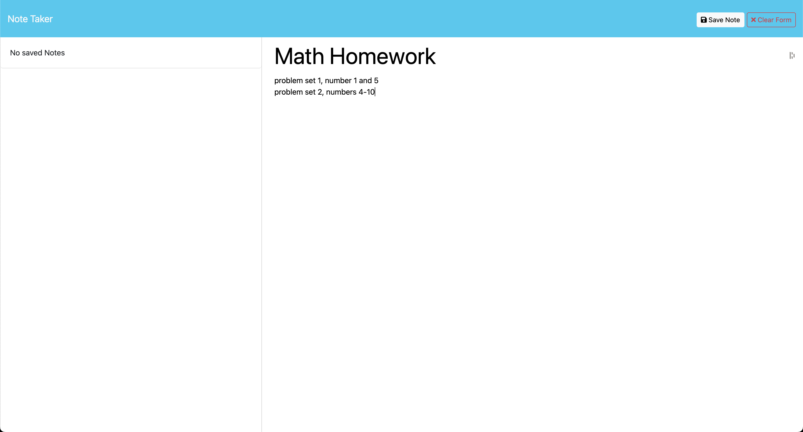
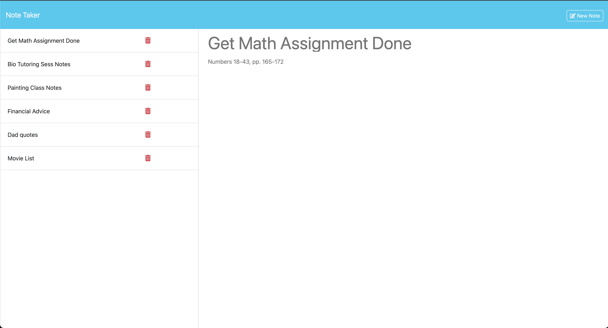

# Note Taker

[Check Out the Live Site Here!](https://week-11-challenge-4a3m.onrender.com)


## Description
The Note Taker is a full-stack application that allows users to write, save, and delete notes. This app uses an Express.js back end to store and retrieve notes from a JSON file, providing an easy way for users to keep track of tasks and organize their thoughts. Users can view their saved notes, add new ones, and delete notes as needed.This project is perfect for small business owners or anyone needing a simple tool to manage daily tasks.

## Table of Contents
- [Installation](#installation)
- [Usage](#usage)
* [License](#license)
- [Contributing](#contributing)
- [Tests](#tests)
- [Questions](#questions)

## Installation

To run this application locally:

1.	Clone the repository:
```
git clone https://github.com/yourusername/note-taker.git
```
2. Navigate to the project directory:
```
cd Week-11-Challenge
```

3. Install the dependencies:
```
npm install
```
4. Start the application:
```
npm start
```
this will run the application on http://localhost:3000.

## Usage
To use the Note Taker application:

1.	Open your browser and navigate to the deployed app link.
2.	On the landing page, click on the link to the Notes page.
3.	On the Notes page:
•	Existing notes are listed on the left-hand column.
•	Enter a new note title and text in the right-hand column.
•	Click the Save button to store the new note.
•	Click on an existing note to view or edit it.
•	You can delete a note by clicking the trash icon next to it.






## License

This project is licensed under the MIT license.

## Contributing

Contributions are welcome! Feel free to fork the repository and submit pull requests to improve the functionality or fix bugs.

## Tests

This project doesn’t include any test suites, but you can manually test it by interacting with the live application or running it locally.

## Questions

If you have any questions, feel free to reach out:
- GitHub: [wilsacker](https://github.com/wilsacker)
- Email: williamsuttona@gmail.com

## Sources

This project was completed with the help of the following resources:

- [ChatGPT](https://chat.openai.com) - Used for guidance and assistance in building and troubleshooting parts of the application.
- [Node.js Documentation](https://nodejs.org/en/docs/) - For understanding the setup and use of Node.js.
- [Express.js Documentation](https://expressjs.com/en/starter/installing.html) - For configuring the Express.js server.
- [MDN Web Docs](https://developer.mozilla.org/) - For information on JavaScript functions and web development.